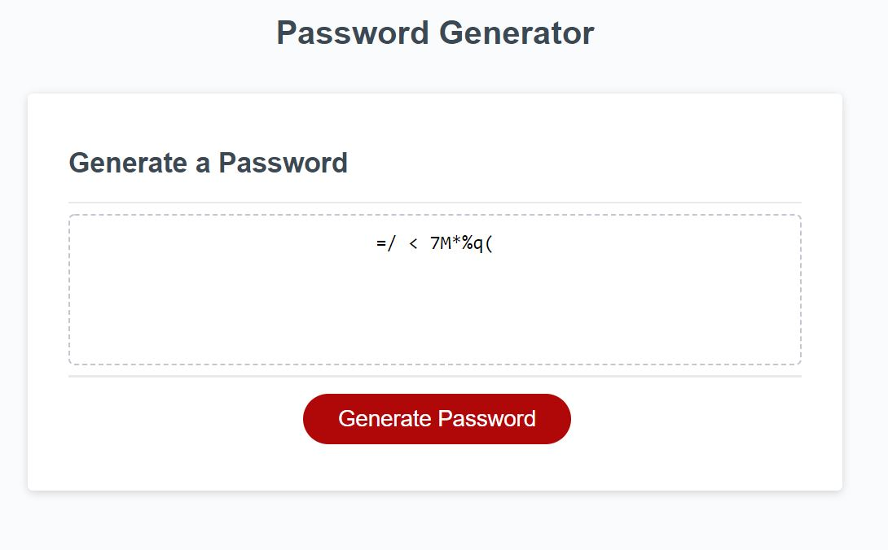

# Password_Generator

## About 
This is a simple password generator that uses JavaScript. Users are able to select a password length between 8 to 128 characters. Users will also have the choice of selecting whether that password will contain Upper-Case, Lower-Case, Numbers, or Special characters.

Screenshot:

Url:
https://kcrawford101.github.io/Password_Generator/ 